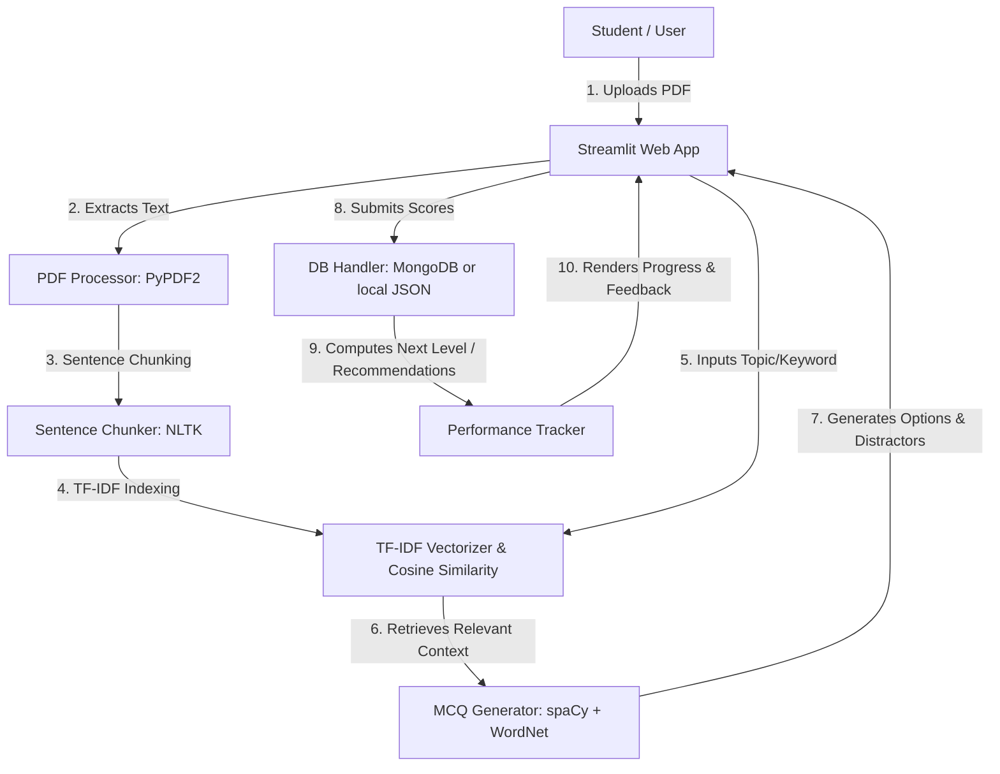

# RAG-Powered Adaptive MCQ Generation System

An intelligent, self-paced learning tool built as a B.Tech Final Year Project. This system extracts and chunks text from user-uploaded PDFs, retrieves context-relevant passages using **Retrieval-Augmented Generation (RAG)** principles (via TF-IDF and Cosine Similarity), generates MCQs at three difficulty levels, tracks user progress in MongoDB (with local JSON fallback), and recommends customized study paths.

---

## 📌 Features

- **PDF Upload & Text Processing**: Extracts text using `PyPDF2` and tokenizes/chunks sentences using `NLTK`.
- **Context-Aware Retrieval (RAG)**: Employs `TF-IDF Vectorizer` and `Cosine Similarity` via `scikit-learn` to fetch passages relevant to a specific topic or keyword.
- **NLP MCQ Engine**: Dynamically formulates question blanks, extracts answer candidates using `spaCy` (NER and POS tagging), and pulls semantic distractors (incorrect choices) using `WordNet`.
- **Adaptive Performance Tracker**: Adapts quiz difficulty (Easy, Medium, Hard) and tracks success trends.
- **Dual-Storage Backend**: Persists user profiles and score metrics directly to a **MongoDB Atlas** database, falling back to a **local JSON database (`user_data.json`)** if no connection string is supplied.
- **Rich Analytics & Feedback Dashboard**: Renders interactive progression graphs and recommends targeted passages to re-read.

---

## 🏗️ Architecture



---

## 📂 Project Structure

```
RAG/
├── app.py                      # Main Streamlit application
├── requirements.txt            # Python dependencies
├── packages.txt                # System packages for Hugging Face Spaces
├── README.md                   # Project documentation
├── .streamlit/
│   └── config.toml             # Custom theme settings
└── modules/
    ├── __init__.py
    ├── pdf_processor.py        # PDF extraction & text chunker
    ├── retriever.py            # TF-IDF RAG retrieval engine
    ├── mcq_generator.py        # NLP-based MCQ question generator
    ├── db_handler.py           # MongoDB & JSON database handler
    └── performance_tracker.py  # User score analytics & study recommendations
```

---

## 🛠️ Setup Instructions

### 1. Prerequisites
Make sure you have Python 3.8 to 3.11 installed.

### 2. Installation
Clone this directory and install the necessary libraries:
```bash
pip install -r requirements.txt
```

### 3. Download Language Models
Download the standard English model for `spaCy` and NLP databases:
```bash
python -m spacy download en_core_web_sm
python -c "import nltk; nltk.download('punkt_tab'); nltk.download('averaged_perceptron_tagger_eng'); nltk.download('wordnet'); nltk.download('stopwords'); nltk.download('omw-1.4')"
```

### 4. Running the Application Locally
Launch the application server:
```bash
streamlit run app.py
```
Open `http://localhost:8501` in your browser. By default, it will save user profiles and performance metrics to a local `user_data.json` file.

---

## 📊 Database Configurations (Optional)

To enable persistent cloud storage via **MongoDB Atlas**:
1. Create a free cluster on MongoDB Atlas.
2. Get your connection string (URI).
3. Add the URI as an environment variable:
   ```bash
   # Windows PowerShell
   $env:MONGODB_URI="mongodb+srv://<username>:<password>@cluster.mongodb.net/?retryWrites=true&w=majority"
   
   # Linux/macOS Bash
   export MONGODB_URI="mongodb+srv://<username>:<password>@cluster.mongodb.net/?retryWrites=true&w=majority"
   ```
   *Alternatively, when deploying on Streamlit Community Cloud or Hugging Face, add `MONGODB_URI` to your project **Secrets**.*

---

## 🚀 Deployment on Hugging Face Spaces

1. Create a new **Space** on Hugging Face.
2. Select **Streamlit** as the SDK.
3. Commit and push the project files to the Hugging Face repository:
   - Ensure `requirements.txt` and `packages.txt` are at the root level.
   - Hugging Face automatically installs package binaries listed in `packages.txt` and python packages from `requirements.txt`.
4. Add your database connection string in the Space's settings page:
   - Name: `MONGODB_URI`
   - Value: `your-mongodb-connection-string`
5. The Space will build and deploy automatically!
